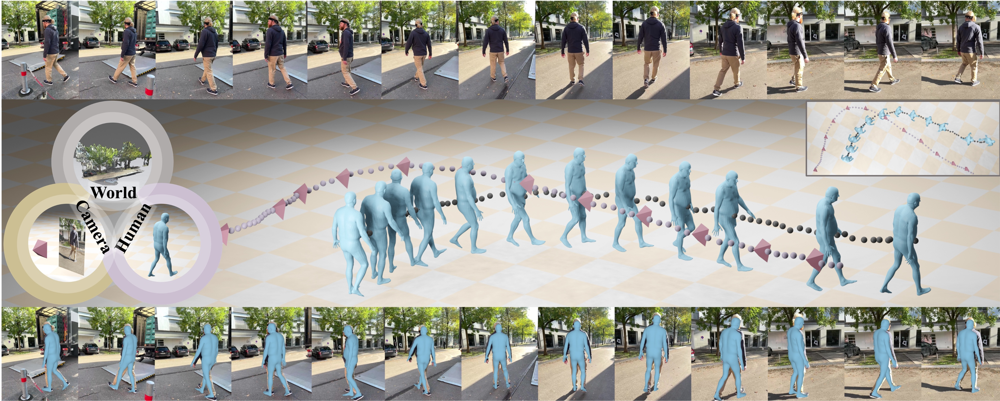

# WHAC: World-grounded Humans and Cameras

This is the official implementation of [**WHAC: World-grounded Humans and Cameras (ECCV 2024)**](https://eccv.ecva.net/virtual/2024/poster/1710), featuring the latest foundation model for human pose and shape estimation with [**SMPLest-X**](https://arxiv.org/abs/2501.09782).



<div align="center">
    <a href="https://wqyin.github.io/projects/WHAC/" class="button"><b>[Homepage]</b></a> &nbsp;&nbsp;&nbsp;&nbsp;
    <a href="https://www.ecva.net/papers/eccv_2024/papers_ECCV/papers/04945.pdf" class="button"><b>[Paper]</b></a> &nbsp;&nbsp;&nbsp;&nbsp;
    <a href="https://arxiv.org/abs/2403.12959" class="button"><b>[arXiv]</b></a> &nbsp;&nbsp;&nbsp;&nbsp;
    <a href="https://github.com/wqyin/SMPLest-X" class="button"><b>[SMPLest-X]</b></a> &nbsp;&nbsp;&nbsp;&nbsp;
    <a href="https://github.com/caizhongang/SMPLer-X" class="button"><b>[SMPLer-X]</b></a> &nbsp;&nbsp;&nbsp;&nbsp;
</div>

---
## Installation

#### **Prepare the environment**

```
git clone https://github.com/wqyin/WHAC.git --recursive
cd WHAC

bash scripts/installation.sh
```
#### **Download the pretrained model for WHAC**
- Pretrained model will be released soon.
#### **Setup [SMPLest-X](https://github.com/wqyin/SMPLest-X)**
- Prepare the pretrained models and parametric human models for SMPLest-X following the official instructions [here](https://github.com/wqyin/SMPLest-X?tab=readme-ov-file#preparation). 
- Make sure the file structure under `./third_party/SMPLest-X` is correct.
#### **Setup [DPVO](https://github.com/princeton-vl/DPVO)**
- Setup steps for DPVO are included in `./scripts/installation.sh`. 
- Refer to the [Setup and Installation](https://github.com/princeton-vl/DPVO?tab=readme-ov-file#setup-and-installation) section if there is any issue during installation.

#### **File structure**
```
.
├── assets
├── configs
├── demo
├── lib
├── outputs
├── pretrained_models
│   └── whac_motion_velocimeter.pth.tar  # will be released soon
├── scripts
├── third_party
│   ├── DPVO
│   │   └── pretrained_models
│   │       └── dpvo.pth
│   └── SMPLest-X
│       ├── pretrained_models
│       │   └── smplest_x_h40
│       │       ├── smplest_x_h40.pth.tar
│       │       └── config_base.py
│       └── human_models
│           └── human_model_files
├── whac
├── README.md
└── requirements.txt
```

## Inference
- Place the video under `./demo` folder.
```
bash scripts/inference.sh {SEQ_NAME}

e.g. bash scripts/inference.sh dance.mp4
```

## WHAC-A-Mole
Check out our [homepage](https://wqyin.github.io/projects/WHAC/) for dataset download links.

https://github.com/wqyin/WHAC/assets/37542645/339e1447-6211-4a4f-8ba4-957c028bd2f7


## Citation
```text
@inproceedings{yin2024whac,
  title={Whac: World-grounded humans and cameras},
  author={Yin, Wanqi and Cai, Zhongang and Wang, Ruisi and Wang, Fanzhou and Wei, Chen and Mei, Haiyi and Xiao, Weiye and Yang, Zhitao and Sun, Qingping and Yamashita, Atsushi and Yang, Lei and Liu, Ziwei},
  booktitle={European Conference on Computer Vision},
  pages={20--37},
  year={2024},
  organization={Springer}
}
```
```text
@article{yin2025smplest,
  title={SMPLest-X: Ultimate Scaling for Expressive Human Pose and Shape Estimation},
  author={Yin, Wanqi and Cai, Zhongang and Wang, Ruisi and Zeng, Ailing and Wei, Chen and Sun, Qingping and Mei, Haiyi and Wang, Yanjun and Pang, Hui En and Zhang, Mingyuan and Zhang, Lei and Loy, Chen Change and Yamashita, Atsushi and Yang, Lei and Liu, Ziwei},
  journal={arXiv preprint arXiv:2501.09782},
  year={2025}
}
```
