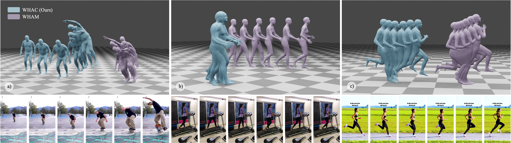

# WHAC: World-grounded Humans and Cameras

    <a href="https://wqyin.github.io/projects/WHAC/" class="button"><b>[Homepage]</b></a> &nbsp;&nbsp;&nbsp;&nbsp;
    <a href="https://arxiv.org/" class="button"><b>[arXiv]</b></a> &nbsp;&nbsp;&nbsp;&nbsp;
    <a href="https://github.com/caizhongang/SMPLer-X" class="button"><b>[SMPLer-X]</b></a> &nbsp;&nbsp;&nbsp;&nbsp;

---

Code coming soon... 

[Sign-up](https://forms.gle/kpDrdipkE5JeMoWd6) for updates.

## Visualization

## WHAC-A-Mole

